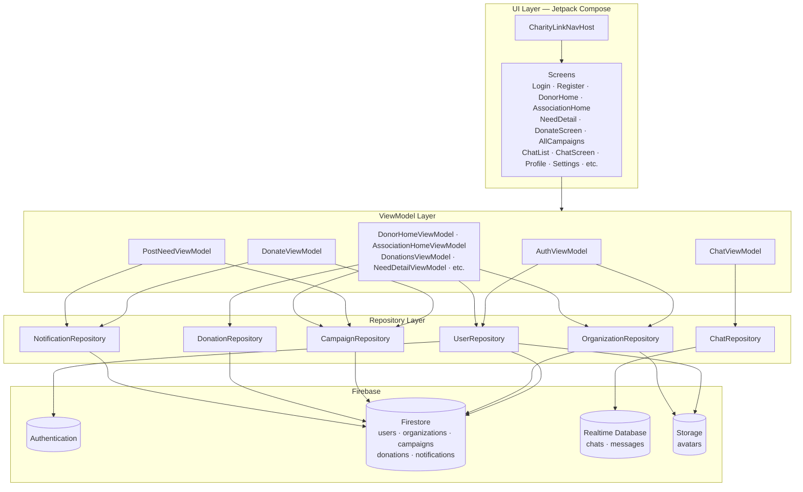

# CharityLink

CharityLink is an Android application that connects donors with verified charitable organizations. Donors can discover associations, browse active campaigns and urgent needs, donate, track their donation history, and message organizations directly. Associations can manage their profile, publish and edit campaigns, track incoming donations, and respond to donor messages.

## Team Members

- Abderrahim CHABIR
- Zakaria Aaribi

## Main Features

### For Donors
- Browse verified associations and search/filter by category
- View active campaigns and urgent needs with live progress (raised / goal)
- Donate to a campaign with a custom or quick-pick amount, plus an optional message
- Message an association directly from a campaign card, a campaign's detail page, or their profile
- View donation history, with the ability to select and delete past donations
- Receive notifications for donation activity and campaign updates
- Edit profile (name, photo) and switch app language (English / French / Arabic)
- Sign in with Email or Google (Facebook sign-in UI is present as a placeholder, not yet implemented)

### For Associations
- Manage an organization profile, including logo/photo
- Post, edit, and delete campaigns ("needs")
- Dashboard with total donations received and number of unique donors
- Reply to donor messages
- Receive notifications when a campaign is funded or fully reached

### Shared
- FAQ and Support screens for help and contact information
- Settings screen: language, notification preferences, password reset, about

## Dependencies

The project is managed entirely through Gradle — no manual downloads are required beyond the tooling below. On first build, Gradle will automatically fetch every library listed in `app/build.gradle.kts` and `gradle/libs.versions.toml`.

**Required tooling:**
- Android Studio (latest stable recommended)
- JDK 21 (the project's Gradle toolchain targets JDK 21 — if your build fails with a `javaCompiler`/toolchain error, install a full JDK 21, not just a JRE)
- Android SDK with `compileSdk` / `targetSdk` 36 and `minSdk` 28 installed via the SDK Manager
- A `google-services.json` file for your own Firebase project, placed in `app/` (not committed to the repo — see Setup below)

**Key libraries used:**
| Library | Purpose |
|---|---|
| Jetpack Compose (BOM `2026.02.01`) + Material 3 | UI |
| Navigation Compose | Screen navigation |
| Firebase Auth | Email & Google sign-in |
| Firebase Firestore | Campaigns, donations, users, organizations, notifications |
| Firebase Realtime Database | Chat messages |
| Firebase Storage | Profile photos / organization logos |
| Coil | Async image loading |
| AndroidX Credentials + Google ID | Google Sign-In |
| AndroidX DataStore Preferences | Local caching of user session data |
| AndroidX AppCompat | Per-app language switching |

**Versions:** Kotlin `2.2.10` · AGP `9.2.1` · Gradle `9.4.1`.

## Setup

1. Clone the repository.
2. Create a Firebase project (or use the team's existing one) with Authentication, Firestore, Realtime Database, and Storage enabled.
3. Download `google-services.json` from the Firebase Console and place it in `app/google-services.json`.
4. Open the project in Android Studio and let Gradle sync — all dependencies download automatically.
5. Run on an emulator or device (minimum API 28).

## Architecture

The app follows an **MVVM** pattern with a **Repository** layer abstracting Firebase access from the UI.

**Data models:** `User`, `Organization`, `Campaign`, `Donation`, `Notification`, `Message`/`Chat`.

**Local persistence:** `UserPreferences` (DataStore) caches the signed-in user's role, name, email, photo URL, and language preference so the UI can render immediately on launch without waiting on a network round-trip, and re-syncs from Firestore in the background.

## Screenshots

| Onboarding | Donor Home | Campaign Detail |
|---|---|---|
|  |  |  |

| Donate | Chat | Association Home |
|---|---|---|
|  |  |  |
